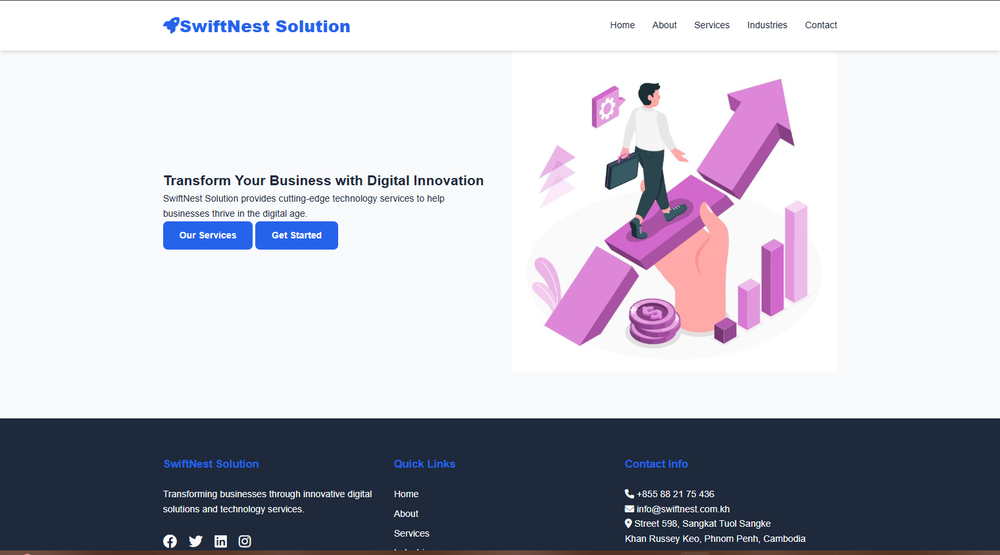

# swiftnest-solution

This project is a web application for Swiftnest, providing information about services, industries, and contact details.

## Project Structure

```
swiftnest-solution/
├── src/
│   ├── index.html
│   ├── about.html
│   ├── services.html
│   ├── industries.html
│   ├── contact.html
│   ├── css/
│   │   └── style.css
│   ├── js/
│   │   └── script.js
│   └── images/
│       ├── hero.jpg
│       ├── client1.png
│       ├── client2.png
│       └── client3.png
```

## Getting Started

To get started with the project, clone the repository and open the `index.html` file in your web browser.

# SwiftNest Solutions



A responsive multi-page website for SwiftNest Solution, created as an educational project for [Course Name]. Demonstrates modern web development techniques using semantic HTML, CSS Flexbox/Grid, and vanilla JavaScript.

## Key Features
- ✅ **5 Responsive Pages**: Home, About, Services, Industries, Contact
- 🎯 **Service Filtering System**: Dynamic category filtering without page reload
- 📱 **Mobile-First Design**: Fully responsive on all devices
- ✨ **Interactive Elements**: Form validation, smooth animations
- 🧩 **Component-Based Architecture**: Reusable UI components

## Technical Highlights
- **Pure HTML/CSS/JS** (no frameworks)
- CSS Variables for consistent theming
- Flexbox/Grid layouts
- Semantic HTML5 markup
- JavaScript DOM manipulation
- Responsive navigation menu

## Educational Objectives
1. Implement responsive web design principles
2. Demonstrate DOM manipulation skills
3. Create an accessible, semantic HTML structure
4. Showcase UI/UX design capabilities
5. Practice version control with Git

## View Project
1. Clone repository: `git clone https://github.com/your-username/swiftnest-solutions-website.git`
2. Open `index.html` in any modern browser

Developed for Web-design by teacher```Keo Leakhena``` at Norton University • Chen Pisal, Hach Tevin, Phom Pheakkdey, Seng Theara • 31/5/2025
